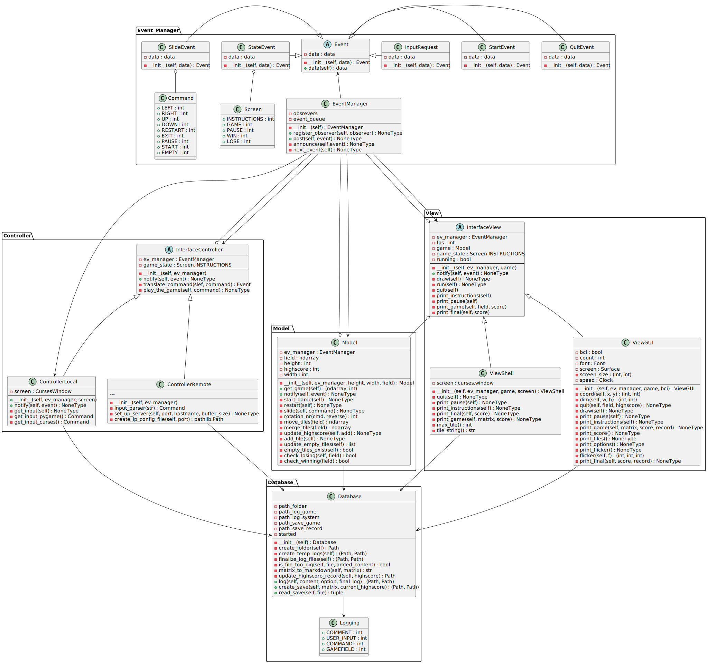

# Warning: Flashing Lights!
Flashing lights occur when starting the program with specific settings or viewing the GIFs below the README.

# What is Project2048
Project2048 lets a player play the game "2048" with different controls, including a brain computer interface (short: BCI).

# More context
1. Project2048 was developed as part of the "Teamprojekt" course at the University of Tübingen. This project, which ran from October 20, 2022, to February 2023, involved four students (including myself) and two supervisors. The full names of the team members and supervisors have been omitted, for privacy reasons.
2. The GitHub repository for this project was deliberately uploaded without a complete Git version history to ensure that the originally used, copyrighted font is not made freely available online. Furthermore, this repository does not contain the EEG data or the corresponding Python library used for data analysis, again due to copyright restrictions.

# How to get started
In order to start the game you need the following shell command, within the directory in which the game is saved:

`$ python -m game2048`

Additionally, you can add these arguments to specify the way how the game is supposed to run

- `--shell` -> Play the game within the shell
- `--logging` -> Log certain processes that happen while starting the program
- `--bci` -> Play the game using a BCI. WARNING: Flashing Lights will be displayed. Keyboard inputs are still accepted, if you choose this option
- `--client [hostname]` -> Start the client (with specific hostname string) that sends inputs to the server (started with `-bci`) (port 2048 is used by default)
- `--_width` -> Choose the width of the gamefield, by entering an integer
- `--_height` -> Choose the height of the gamefield, by entering an integer

# Requirements
In order to start the program you need to have these packages installed:

- numpy Ver. 1.21.4
- pygame Ver. 2.1.2
- pytest Ver. 7.2.0
- Sphinx Ver. 6.1.3
- windows-curses Ver. 2.3.1 (for windows users)

run `$ pip install -r requirements.txt`

# Poster

# GIF animations that help to understand the poster

# Component Model

# Simple Class Diagram

# Class Diagrams

